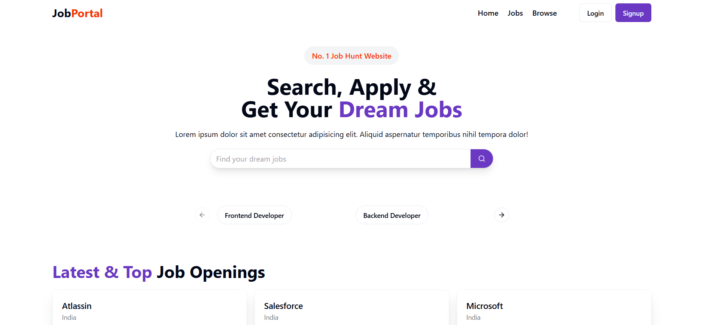
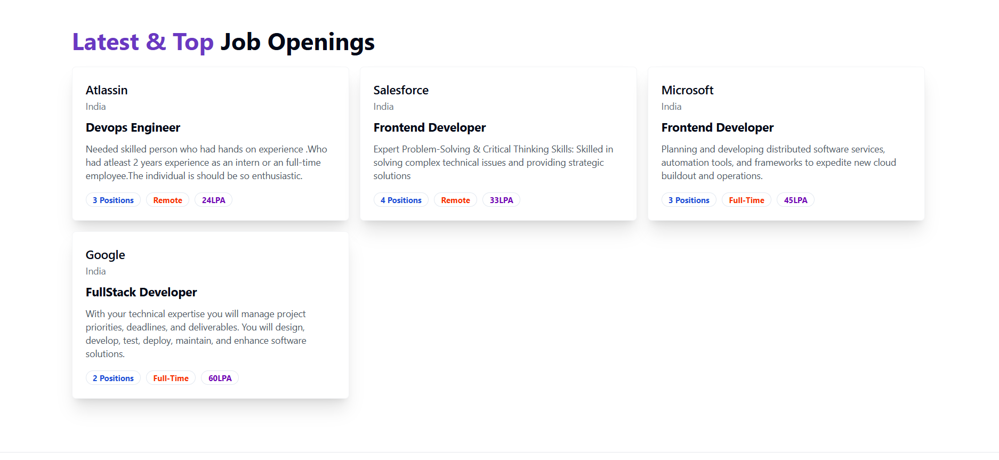
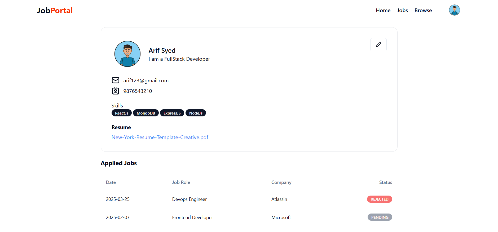
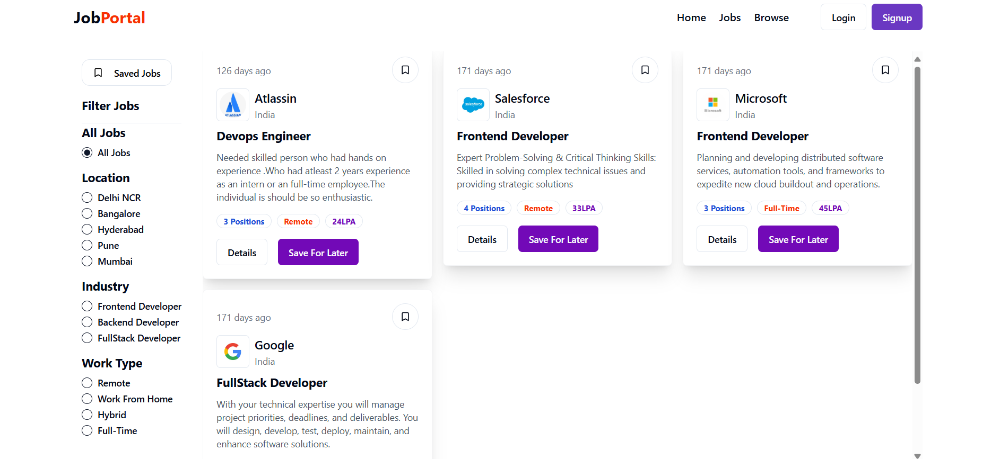

# 💼 Job Portal

A full-stack Job Portal web application built with **MERN Stack**, **Tailwind CSS**, and **JWT Authentication**. It allows users to browse job listings, apply for jobs, and lets recruiters post job opportunities. The application includes real-time updates, secure authentication, file uploads, and a responsive UI.

## 🌐 Live Demo

🔗 [https://job-portal-xi-opal.vercel.app/](https://job-portal-xi-opal.vercel.app/)

---

## 🚀 Features

- 🔐 JWT authentication and protected routes
- 🧑‍💼 Role-based dashboards for **Users** and **Recruiters**
- 📤 Resume and profile picture uploads (Cloudinary)
- 🧾 View job details, apply, and track applications
- 📁 Recruiters can post and manage jobs
- 💬 Application statuses: Pending / Rejected
- 📱 Fully responsive UI built with Tailwind CSS
- ☁️ Deployed on **Vercel** (frontend) and **Render** (backend)

---

## 🛠️ Tech Stack

**Frontend**:
- React.js (Vite)
- Redux Toolkit
- Tailwind CSS
- React Router
- Axios

**Backend**:
- Node.js
- Express.js
- MongoDB (Mongoose)
- JWT
- Multer
- Cloudinary

---

## 📂 Project Structure

```
job-portal/
├── backend/
│   ├── controllers/           # Business logic handlers
│   ├── middlewares/           # Auth & file upload
│   ├── models/                # MongoDB schemas
│   ├── routes/                # API endpoints
│   ├── utils/                 # Cloudinary & DB helpers
│   ├── .env
│   ├── index.js
│   └── package.json
│
├── frontend/
│   ├── public/                # Static assets
│   └── src/
│       ├── assets/            # SVGs & images
│       ├── components/        #components/pages
│       │   ├── admin/         # Admin dashboard
│       │   ├── auth/          # Login/Signup pages
│       │   ├── shared/        # Navbar, footer
│       │   └── ui/            # Reusable UI elements
│       ├── hooks/             # Custom hooks
│       ├── lib/               # Utility functions
│       ├── redux/             # Global state
│       └── utils/             # Constants & configs
│   ├── App.jsx
│   ├── main.jsx
│   └── package.json
│
├── README.md
```

---

## 💻 Local Setup

### 1️⃣ Clone the repository

```bash
git clone https://github.com/sdarif981/job-portal.git
cd job-portal
```

### 2️⃣ Start the backend

```bash
cd backend
npm install
nodemon index.js
```

### 3️⃣ Start the frontend

```bash
cd frontend
npm install
npm run dev
```

### 4️⃣ Update API endpoints for local development

Edit `frontend/src/utils/constant.js`:

```js
export const USER_API_END_POINT = "http://localhost:5000/api/v1/user";
export const JOB_API_END_POINT = "http://localhost:5000/api/v1/job";
export const APPLICATION_API_END_POINT = "http://localhost:5000/api/v1/application";
export const COMPANY_API_END_POINT = "http://localhost:5000/api/v1/company";
```

---

## 📸 Screenshots

### 🏠 Home Page & 🔍 Job Listings

| Home Page | Home Page Jobs|
|-----------|--------------|
|  |  |

### 🧾 Job Filters & 📂 Dashboard

| Job Filters | User Dashboard |
|-------------|----------------|
|  |  |


---

## 🌍 Deployment

- **Frontend**: [Vercel](https://job-portal-xi-opal.vercel.app/)
- **Backend**: [Render](https://job-portal-1-m0br.onrender.com)

---

## 🙋‍♂️ Author

**Arif Syed**

- 📧 [Email](mailto:sdarif981@gmail.com)  
- 🧑‍💻 [GitHub](https://github.com/sdarif981)

---

## 📄 License

This project currently does **not** include an open-source license.  
You may use it for learning purposes only. For commercial or production use, please contact the author.

---

> 🚧 This is an actively developed project. Suggestions and improvements are welcome!
